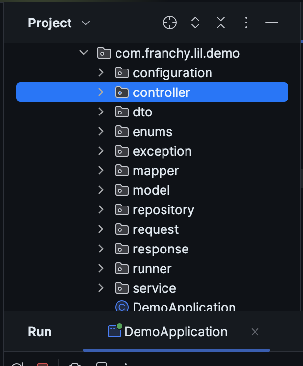

# Interview Spring Boot and Java Template

## Overview
This project is a comprehensive Spring Boot application designed to demonstrate proficiency in various Spring technologies and Java frameworks. It includes models for `Customer`, `Order`, and `User`, along with their respective repositories, services, controllers, and DTOs. The application is connected to **PostgreSQL** and **Redis Cache**, and implements **JWT security** for authentication.

## Technologies Used
- **Java 17 / 21**
- **Maven 3.3**
- **Spring MVC**: For building web applications.
- **Spring Boot 3.4.3**: To simplify the setup and development of Spring applications.
- **Spring Security with JWT**: For securing the application.
- **Spring Data**: To simplify data access.
- **OpenAPI 3.0**: For API documentation.
- **Redis Cache**: For caching.
- **Spring Cloud**: For building distributed systems.
- **MapStruct**: For mapping between DTOs and entities.
- **Docker**: For containerization.
- **Spring Data JPA & Redis**: For data persistence.
- **Dependency Injection**: To manage dependencies.
- **Log4j**: for debugging purposes.

## Features
- CRUD operations for Customer, Order, and User.
- JWT-based authentication.
- Caching with Redis.
- API documentation with OpenAPI 3.0.
- PostgreSQL
- Spring Profiles

## Project Structure

 

## Setup Instructions
1. **Clone the repository**:

   ```bash
   git clone <repository-url>
   cd <repository-directory>
   ```

2. **Install Docker**: Follow the instructions on the Docker website to install Docker on your machine.

3. You have two options regarding the Docker process related to the Dockerfile and docker-compose files:

    - 1 - If you only use the Docker Compose file, you will need to install Java 17 or above on your machine and then run the docker-compose file, which includes the use of PostgreSQL and Redis.

    - 2 - Modify the docker-compose file to call the Dockerfile from there. You won't need to install Java on your machine because the Dockerfile includes Java and the compilation and execution of the application.

   ```bash
    docker compose -f docker-compose.yml -p demo up -d 
   ```

## API Documentation
Access the OpenAPI documentation at `http://localhost:3000/swagger-ui/index.html`


## Contributing

Pull requests are welcome. For major changes, please open an issue first
to discuss what you would like to change.

Please make sure to update tests as appropriate.

## Contact

franchyreyes@hotmail.com
